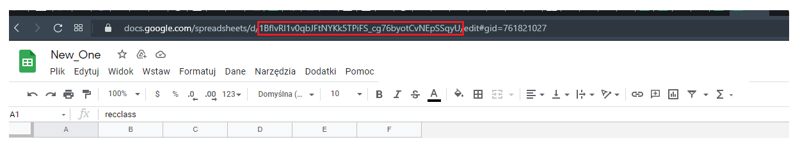
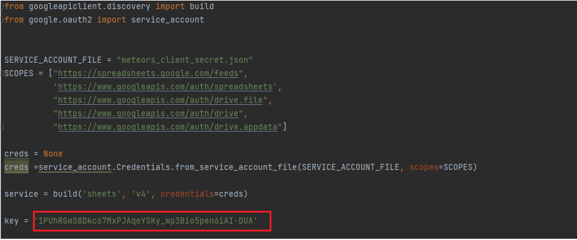
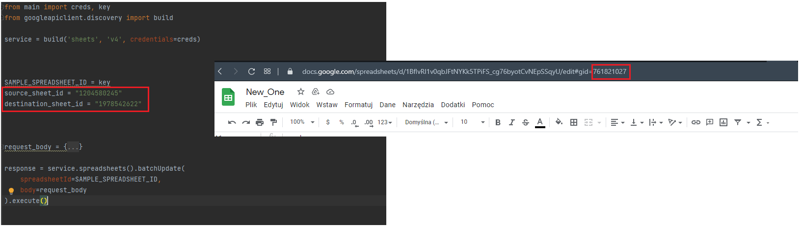

# Meteors-analysis
> Analysis based on data from source: https://data.nasa.gov/resource/gh4g-9sfh.json . This data
> is part of greater surce avaiable with description here: https://data.nasa.gov/Space-Science/Meteorite-Landings/gh4g-9sfh


## Table of Contents

* [Technologies Used](#technologies-used)
* [Setup](#setup)
* [Acknowledgements](#acknowledgements)

<!-- * [License](#license) -->


## Technologies Used
- Python - version 3.9.2
- pandas - version 1.2.4
- sqlite3
- google apis (Google Sheet API and Google Drive API)


## Setup
```shell
# Get the code
git 
cd Meteors_analysis

# Run subsequent scripts
create_spreadsheet.py
source_data_operations.py
import_csv_to_google.py
create_pivot_table.py
sql_queries.py

```
### Spreadsheet id

At this moment the scripts are semi-automated thus there is need to copy
spreadsheet id after creation of new spreadsheet and change it in presented place in main.py:




### Source and destination sheets number for pivot table

Also there is need to change source and destination sheets numbers in
script connected with creation of pivot table (create_pivot_table.py)




## Acknowledgements
To make possible to use this script is needed at first to set properties of projects
for Google Apis.

Those resources could be helpful:
* https://www.youtube.com/watch?v=4ssigWmExak
* https://developers.google.com/sheets/api
* https://www.youtube.com/watch?v=sAgWCbGMzTo&list=PL3JVwFmb_BnSee8RFaRPZ3nykuMRlaQp1


<!-- Optional -->
<!-- ## License -->
<!-- This project is open source and available under the [... License](). -->

<!-- You don't have to include all sections - just the one's relevant to your project -->