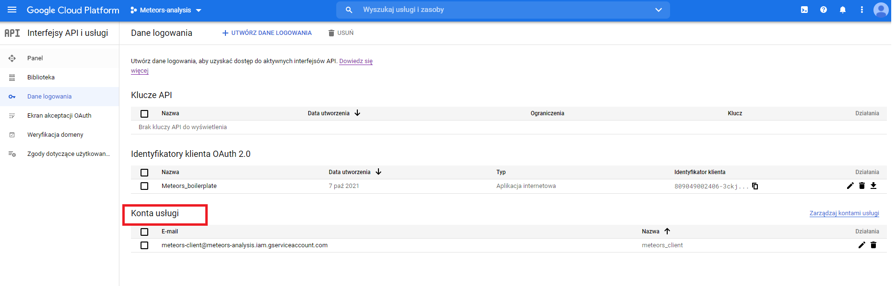

# Meteors-analysis

> Simple console-type script which involves Google Sheet and Drive API to achieve some analytical results from selected
> data (in this sample it contains data from https://data.nasa.gov/resource/gh4g-9sfh.json) in full automatic way 
> (by console usage).


## Table of Contents

* [General Info](#general-information)
* [Technologies Used](#technologies-used)
* [Setup](#setup)
* [Acknowledgements](#acknowledgements)
* [Hints](#hints)

<!-- * [License](#license) -->

## General Information
The main reason to create such script was task from one of employee during his requirement process. This was one task
which contains subsequent minor quests:
- Download JSON file from given source and export data into csv
- Export csv file with data into Google Sheet
- Create pivot table which presents how many meteors divided by class fell in every year
- Write a query which returns average mass of every meteor class  
- Write second query which returns meteors class which mass does not exceed 5000 grams 

## Technologies/Libraries Used
- Python - version 3.9.2
- pandas - version 1.2.4
- sqlite3
- sqlalchemy
- google apis (Google Sheet API and Google Drive API)
- json
- urllib3
- certifi
- gspread


## Setup
```shell
# Get the code
git clone https://github.com/cryoMike90s/Meteors_analysis
cd Meteors_analysis
run console.py
```

Subsequent steps after run `console.py` are easy to deal with.

### API

To make possible to use Sheet and Drive APIS there is mandatory to enable them in our project and then
set authorization in a way which is described and explained point by point here:
https://www.youtube.com/watch?v=4ssigWmExak .

Please make sure that your `files/meteors_client_secret.json` is that one file from Service 
Account in API authorization tab and the original name is changed to pointed one.




## Acknowledgements

Those resources could be helpful:
* https://www.youtube.com/watch?v=4ssigWmExak
* https://developers.google.com/sheets/api
* https://www.youtube.com/watch?v=sAgWCbGMzTo&list=PL3JVwFmb_BnSee8RFaRPZ3nykuMRlaQp1

## Hints

If described script is run by utilization of IntelliJIdea it could occur that is mandatory to
set "Modify Run Configuration" of individual python files inside the `code` directory as below:


Please ignore described error value which is more information than problem:


<!-- Optional -->
<!-- ## License -->
<!-- This project is open source and available under the [... License](). -->

<!-- You don't have to include all sections - just the one's relevant to your project -->